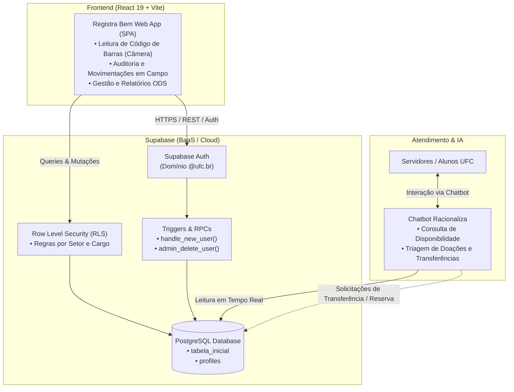
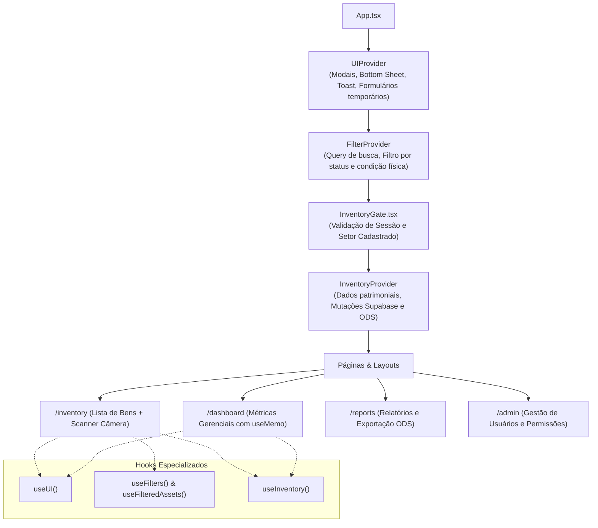
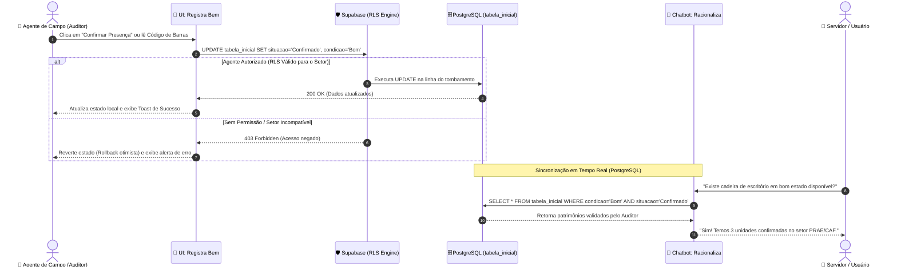
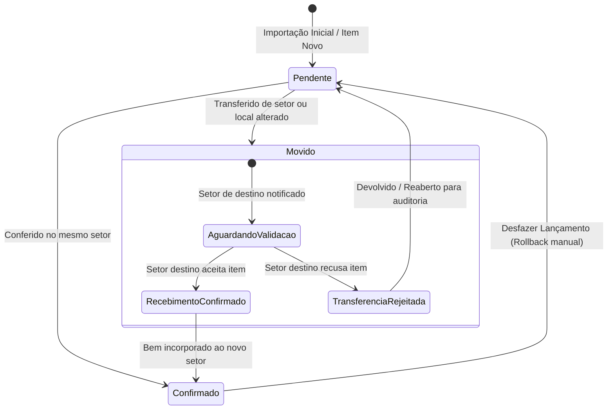
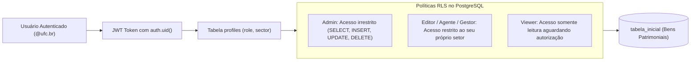

# 🏛️ Arquitetura do Sistema — Registra Bem & Ecossistema

Este documento descreve a arquitetura técnica, modelo de dados, fluxos de integração e decisões de design do **Registra Bem** e sua integração com o ecossistema **Racionaliza**.

---

## 1. 🌐 Visão Macro da Arquitetura (Ecossistema)

O ecossistema divide-se em três pilares principais: **Operação em Campo** (Registra Bem), **Base Unificada de Dados e Segurança** (Supabase) e **Interface de Atendimento e Consulta** (Racionaliza).

---

## 2. 🧩 Arquitetura do Frontend (React + Context API Desacoplada)

Para garantir alto desempenho e eliminar re-renderizações desnecessárias, a gestão de estado é organizada em **três contextos desacoplados e especializados**:

### Responsabilidade de Cada Camada:
1. **`UIContext`**: Estados visuais voláteis (`isDetailSheetOpen`, `selectedAsset`, `toast`, inputs temporários de modal). Mudanças de digitação em formulários não disparam re-render nas listas de patrimônio.
2. **`FilterContext`**: Termo de busca e pílulas de filtro (`search`, `statusFilter`, `conditionFilter`). O hook utilitário `useFilteredAssets(sectorAssets)` memoiza a lista filtrada.
3. **`InventoryContext`**: Regras de negócio persistidas, comunicação direta com o Supabase e sincronização da coleção de bens (`assets`).

---

## 3. 🔄 Fluxo de Confirmação e Auditoria em Tempo Real

O diagrama abaixo detalha o ciclo operacional em que um auditor de campo confirma a localização e condição de um bem, refletindo instantaneamente para o chatbot do sistema **Racionaliza**:

---

## 4. 🔀 Ciclo de Vida do Patrimônio & Transferência entre Setores

O fluxo de movimentação física de bens entre divisões da PRAE implementa conferência de dupla checagem:

---

## 5. 🛡️ Arquitetura de Segurança & Permissões (RLS)

O sistema adota segurança rigorosa na camada de banco de dados através do **Row Level Security (RLS)** do PostgreSQL:

* **Fonte da Verdade:** O arquivo [`supabase/master.sql`](./supabase/master.sql) define toda a infraestrutura idempotente de RLS, triggers e a procedure `admin_delete_user` com garantia de integridade.