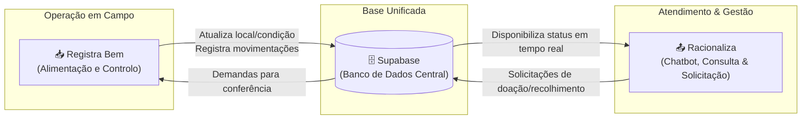

# 📋 Documento de Handover & Transição — Registra Bem

> **Projeto:** Registra Bem — Sistema de Auditoria e Gestão de Patrimônio  
> **Instituição:** Universidade Federal do Ceará (UFC) / Pró-Reitoria de Assistência Estudantil (PRAE)  
> **Data de Atualização:** 25 de Setembro de 2026  
> **Status do Projeto:** Ativo em Produção (Vercel + Supabase)

---

## 1. 📌 Visão Geral do Projeto

O **Registra Bem** é uma aplicação web progressiva e responsiva desenvolvida para modernizar, agilizar e auditar o inventário físico de bens patrimoniais permanentes da **Pró-Reitoria de Assistência Estudantil (PRAE)** da Universidade Federal do Ceará (UFC) e suas divisões associadas.

### 🎯 Objetivo Principal
Substituir o controle manual e planilhas desconexas por uma plataforma web centralizada em tempo real, onde agentes de patrimônio e gestores possam:
- Localizar bens tombados por código ou descrição.
- Confirmar presença física do bem no ambiente de alocação.
- Atualizar a localização exata dentro do setor (sala, bloco, bancada).
- Registrar movimentações entre diferentes divisões/setores da universidade com fluxo de validação e aceite.
- Catalogar "itens extras" (bens físicos encontrados sem cadastro prévio).
- Avaliar a condição física/conservação do patrimônio (*Bom*, *Ruim*, *Inservível*).
- Acompanhar relatórios de auditoria e exportar dados consolidados em formato aberto (`.ods`).

### 👥 Público-Alvo e Papéis de Acesso
- **Administrador (`admin`):** Gestão geral do sistema, aprovação e controle de papéis de usuários, auditoria global de todos os setores.
- **Gestor / Coordenador (`gestor`, `coordenador`):** Acesso a painéis gerenciais e métricas consolidadas de auditoria do setor e da unidade.
- **Agente / Editor (`agente`, `editor`):** Agentes de campo que executam a verificação física, movimentação de bens e registro de itens extras.
- **Visualizador (`viewer`):** Permissão somente-leitura (papel atribuído por padrão a novos cadastros até liberação por um administrador).

### 1.1 🔄 Integração com o Ecossistema: Registra Bem & Racionaliza

É fundamental compreender que o **Registra Bem** não atua de forma isolada. Ele foi concebido como o motor de dados e a infraestrutura operacional de apoio para o sistema **Racionaliza** (idealizado em 2025). Ambos os sistemas partilham o mesmo **Banco de Dados** central, criando um ciclo contínuo entre o trabalho de campo e o atendimento ao servidor.



Com base no fluxo de arquitetura do projeto, o ecossistema divide-se nas seguintes responsabilidades:

#### 📥 Registra Bem (Alimentação e Controlo Operacional)
Atua na base da operação, garantindo que os dados da realidade física correspondam ao sistema:
* **Atualiza:** Regista e atualiza o local exato, a condição física (*Bom*, *Ruim*, *Inservível*) e a disponibilidade do item.
* **Movimenta:** Gere as ações de transferência entre setores, recolhimento e doação de bens.

#### 🗄️ Banco de Dados (Sincronização Central)
Atua como a ponte de comunicação bidirecional. Toda a atualização de inventário feita através do *Registra Bem* reflete-se instantaneamente na base partilhada.

#### 📤 Racionaliza (Consumo, Chatbot e Gestão)
A interface de atendimento e tomada de decisão que consome os dados tratados pelo *Registra Bem*:
* **Consulta:** Permite que os servidores verifiquem no chatbot (Racionaliza) se o item desejado está disponível, quais são as opções e as condições do item procurado.
* **Solicitação:** Caso o item esteja marcado como *Disponível* ou *Recolhido*, o servidor pode solicitar diretamente ao setor responsável pelo registo da doação ou ao depósito.
* **Gerenciamento:** Permite que gestores e administradores tenham acesso rápido aos dados consolidados para avaliação e tomada de decisões na gestão dos bens da unidade.

---

## 2. 🛠️ Tech Stack & Dependências

A aplicação foi construída sobre uma arquitetura frontend moderna e desacoplada, utilizando **React 19** e **Vite**:

| Categoria | Tecnologia / Biblioteca | Versão | Propósito |
| :--- | :--- | :--- | :--- |
| **Core & Framework** | [React](https://react.dev/) | `^19.2.4` | Biblioteca para construção da interface declarativa em componentes. |
| **Linguagem** | [TypeScript](https://www.typescriptlang.org/) | `^5.6.0` | Tipagem estática rigorosa para contratos de API e modelos de dados. |
| **Bundler & Build Tool** | [Vite](https://vitejs.dev/) | `^8.0.1` | HMR ultrarrápido, bundling otimizado e build de produção. |
| **Roteamento** | [React Router DOM](https://reactrouter.com/) | `^7.16.0` | Gerenciamento de rotas SPA, rotas protegidas e navegação em abas. |
| **Backend as a Service** | [@supabase/supabase-js](https://supabase.com/) | `^2.102.1` | Autenticação, banco de dados relacional PostgreSQL, RLS e RPC. |
| **Scanner de Código de Barras** | [html5-qrcode](https://github.com/mebjas/html5-qrcode) | `^2.3.8` | Leitura de códigos de barras de plaquetas patrimoniais via câmera traseira. |
| **Ícones** | [Lucide React](https://lucide.dev/) | `^1.7.0` | Conjunto consistente e moderno de ícones vetoriais. |
| **Exportação de Dados** | [xlsx (SheetJS)](https://sheetjs.com/) | `^0.18.5` | Geração dinâmica de relatórios em planilhas formato `.ods` (OpenDocument). |
| **Visualização de Dados** | [Recharts](https://recharts.org/) | `^3.8.1` | Biblioteca de gráficos SVG para painéis e dashboards. |
| **Estilização** | Vanilla CSS + Design System | — | Design moderno com glassmorphism, temas claro/escuro nativos e variáveis CSS. |
| **Testes Unitários** | [Vitest](https://vitest.dev/) + React Testing Library | `^4.1.7` | Execução de testes de componentes e lógica de domínio. |

---

## 3. 🏗️ Arquitetura e Gerenciamento de Estado

Anteriormente, o sistema utilizava um único `InventoryContext` monolítico que acumulava regras de negócio, chamadas ao Supabase, estado de modais, inputs de formulário e filtros de busca. 

Para eliminar re-renderizações desnecessárias e organizar as responsabilidades, foi realizada uma refatoração dividindo a gestão em **3 Contextos Especializados**:

```
[ App.tsx ]
   │
   ├── <UIProvider>           ─── Gerencia modais, sheets, inputs efêmeros e toasts
   │     │
   │     └── <FilterProvider> ─── Gerencia query de busca, filtros de status e condição
   │           │
   │           └── <Routes>
   │                 │
   │                 └── <InventoryGate>
   │                       │
   │                       └── <InventoryProvider> ─── Dados dos bens, Auth e mutações Supabase
```

### 1. `InventoryContext` (`src/context/InventoryContext.tsx`)
- **Responsabilidade:** Fonte da verdade para os dados persistidos e mutações no banco de dados.
- **Principais Estados:**
  - `assets`: Coleção em memória de todos os bens patrimoniais recuperados do Supabase via hook `useAssets`.
  - `sectorAssets`: Subconjunto de bens pertencentes à divisão/setor do usuário logado (ou todos, caso seja `admin`).
  - `session`, `profile`, `isAdmin`, `isAuthorized`: Informações de sessão e controle de acesso obtidas via hook `useAuthProfile`.
  - `stats` e `progress`: Estatísticas calculadas (total, confirmados, movidos, pendentes, percentual de conclusão).
- **Mutações:**
  - `handleConfirm()`: Confirma a presença física do patrimônio.
  - `handleUpdateLocation()`: Atualiza o local exato (sala/ambiente) com histórico de log.
  - `handleChangeSector()`: Registra transferência do patrimônio para outra divisão.
  - `handleConditionChange()`: Altera o estado de conservação (*Bom*, *Ruim*, *Inservível*).
  - `handleUndoRegistration()`: Desfaz o registro e reverte o bem para *Pendente*.
  - `handleConfirmRecebimento()` e `handleRejectTransfer()`: Fluxo de validação de transferência entre divisões.
  - `handleAddExtra()`: Insere novo item extra no banco.
  - `handleDownloadOds()`: Gera e baixa planilha ODS com a listagem do setor.

### 2. `UIContext` (`src/context/UIContext.tsx`)
- **Responsabilidade:** Controle de visibilidade de janelas, painéis laterais, campos de formulários temporários e notificações.
- **Principais Estados:**
  - `selectedAsset` & `isDetailSheetOpen`: Bem patrimonial atualmente aberto no painel lateral/bottom-sheet.
  - `isAddExtraModalOpen`: Controle do modal para cadastro de item extra.
  - `isSectorChangeOpen`: Controle do modal/select de transferência de setor.
  - Estados de formulários temporários: `newLocation`, `newSector`, `extraTombamento`, `extraName`, `extraLocation`.
  - `toast`: Mensagem temporária exibida em tela para feedback de ações.
  - `reportTab`: Aba atualmente ativa na tela de relatórios (`'missing'`, `'moved'`, `'extras'`).

### 3. `FilterContext` (`src/context/FilterContext.tsx`)
- **Responsabilidade:** Isolamento completo da lógica de busca e filtragem da lista de patrimônios.
- **Principais Estados:**
  - `search`: Texto digitado na barra de busca (suporta número de tombamento ou palavras no nome do item).
  - `statusFilter`: Filtro por situação de auditoria (`'all'`, `'pending'`, `'confirmed'`, `'moved'`).
  - `conditionFilter`: Filtro por estado físico (`'all'`, `'Bom'`, `'Ruim'`, `'Inservível'`).
- **Hook Utilitário `useFilteredAssets(sectorAssets)`:**
  Encapsula a função de filtro memoizada para que qualquer página ou componente possa renderizar a lista filtrada sem duplicar código.

---

## 4. ⚡ Funcionalidades Implementadas

### 🔐 1. Autenticação e Segurança (Supabase Auth & RLS)
- Restrição institucional: Validação exigindo e-mails `@ufc.br`.
- Criação automática de perfil na tabela `profiles` via trigger PostgreSQL no Supabase.
- Papéis e autorização:
  - `admin`, `editor`, `agente`, `gestor`, `coordenador`: Autorizados a editar dados.
  - `viewer`: Perfil de acesso inicial que aguarda liberação de um administrador.
- **Row Level Security (RLS):** Usuários comuns só enxergam e atualizam patrimônios pertencentes ao seu setor configurado; administradores têm visão irrestrita.

### 📦 2. Listagem e Gestão de Patrimônios (`/inventory`)
- Cards responsivos com dados do tombamento, descrição, setor, localização física e situação.
- Cópia com 1 clique do número de tombamento para a área de transferência (`navigator.clipboard`).
- Indicadores visuais com cores distintas para cada status (*Pendente* em cinza/azul, *Confirmado* em verde, *Movido* em amarelo).

### 🔍 3. Filtros Avançados em Tempo Real
- Busca instantânea por termo ou número de tombamento.
- Pílulas de seleção rápida de status e de condições físicas (*Bom*, *Ruim*, *Inservível*).
- Contador em tempo real na própria pílula indicando quantos itens atendem ao critério.

### 📑 4. Painel de Detalhes (`AssetDetailSheet`)
- Interface adaptativa: gaveta lateral fixa (*sidebar*) no desktop e *bottom-sheet* deslizante no mobile.
- Ações rápidas:
  - **Confirmar Presença:** Altera o status para *Confirmado*.
  - **Atualizar Localização:** Salva novo ambiente específico e gera log de histórico.
  - **Transferir Setor:** Transfere para outro setor da PRAE e dispara fluxo de validação.
  - **Aceite/Rejeição de Transferência:** Usuários do setor de destino podem homologar ou rejeitar bens recebidos.
  - **Desfazer Lançamento:** Restaura o bem para pendente em caso de equívoco.

### 📷 5. Scanner de Código de Barras por Câmera (`BarcodeScannerModal`)
- Modal integrado com a biblioteca `html5-qrcode`.
- Configuração automática para câmera traseira do smartphone (`facingMode: { exact: 'environment' }`).
- Suporte a zoom e botão de lanterna/flash em dispositivos compatíveis.
- Ao identificar o código de barras da etiqueta de tombamento, fecha o scanner e preenche automaticamente o campo de busca.

### ➕ 6. Cadastro de Item Extra (`AddExtraModal`)
- Permite registrar bens encontrados fisicamente no setor que não constavam na planilha original da UFC.
- Insere o item com a flag `isExtra: true`, status confirmado e log de auditoria manual.

### 📊 7. Painel Gerencial / Dashboard (`/dashboard`)
- Acesso exclusivo para administradores e gestores.
- Indicadores de total geral de itens auditados, confirmados, transferidos e pendentes.
- Barra horizontal de saúde e estado de conservação dos bens.
- Gráfico comparativo de progresso percentual dividido por cada setor/coordenadoria da PRAE.
- Ranking das 5 categorias de bens mais comuns.

### 📋 8. Relatórios e Exportação ODS (`/reports`)
- Visualização filtrada de itens pendentes, transferidos ou itens extras.
- Exportação em um clique de arquivo `.ods` (OpenDocument Spreadsheet) compatível com LibreOffice e Microsoft Excel.

### 👥 9. Painel Administrativo de Usuários (`/admin`)
- Listagem de todos os perfis cadastrados no sistema.
- Alteração direta de papel (`admin`, `editor`, `gestor`, `viewer`) e setor associado.
- Exclusão segura de usuários utilizando RPC `admin_delete_user` no Supabase (remove tanto de `auth.users` quanto de `profiles`).

---

## 5. 📁 Estrutura de Pastas e Arquivos

```text
Registra Bem/
├── package.json                 # Scripts raiz do projeto
├── vercel.json                  # Configurações de build e roteamento SPA na Vercel
├── supabase/
│   ├── README.md                # Guia de configuração do banco
│   └── master.sql               # Fonte única da verdade: Schema, RLS, Triggers e RPCs
└── frontend/
    ├── package.json             # Dependências e scripts do frontend
    ├── vite.config.ts           # Configuração do Vite
    ├── tsconfig.json            # Configurações do compilador TypeScript
    ├── index.html               # Ponto de entrada HTML
    └── src/
        ├── main.tsx             # Inicialização do React DOM e BrowserRouter
        ├── App.tsx              # Provedores globais (UI, Filter) e árvore de rotas
        ├── Auth.tsx             # Tela de login e registro institucional
        ├── constants.ts         # Enums de status, lista de setores e utilitários de autorização
        ├── supabaseClient.ts    # Instância única do cliente Supabase (@supabase/supabase-js)
        ├── index.css            # Folha de estilo global, temas e tokens CSS
        │
        ├── components/          # Componentes reutilizáveis de interface
        │   ├── AddExtraModal.tsx        # Modal para registrar bem físico extra
        │   ├── AssetDetailSheet.tsx     # Painel lateral / bottom sheet com ações do bem
        │   ├── BarcodeScannerModal.tsx  # Scanner de código de barras com html5-qrcode
        │   ├── LoadingScreen.tsx        # Tela de transição de carregamento
        │   ├── ReportView.tsx           # Tabela e filtros da tela de relatórios
        │   └── SectorSelector.tsx       # Seletor de setores
        │
        ├── context/             # Gerenciamento de estado global (Context API)
        │   ├── InventoryContext.tsx     # Dados patrimoniais, chamadas Supabase e mutações
        │   ├── UIContext.tsx            # Modais, gavetas, formulários voláteis e toasts
        │   └── FilterContext.tsx        # Busca por texto, filtros de status/condição
        │
        ├── hooks/               # Custom hooks React
        │   ├── useAssets.ts             # Carregamento e sincronização da tabela_inicial
        │   └── useAuthProfile.ts        # Observabilidade de sessão e perfil de usuário
        │
        ├── layouts/             # Wrappers e layouts de rota
        │   ├── InventoryGate.tsx        # Barreira de autenticação e setor obrigatório
        │   └── InventoryLayout.tsx      # Header, navegação lateral/inferior e FAB
        │
        ├── pages/               # Páginas principais da aplicação
        │   ├── DashboardPage.tsx        # Painel gerencial e métricas da unidade
        │   ├── InventoryPage.tsx        # Listagem principal de patrimônios
        │   ├── ReportsPage.tsx          # Página wrapper de relatórios de auditoria
        │   └── UserManagement.tsx       # Gestão administrativa de usuários
        │
        ├── routes/              # Componentes de guarda de rotas
        │   └── AdminRoute.tsx           # Proteção de acesso à rota /admin
        │
        ├── types/               # Definições de tipos TypeScript
        │   └── index.ts                 # Interfaces (Asset, Profile, Stats, UIContextType, etc.)
        │
        └── utils/               # Funções utilitárias puras
            └── assetStatus.tsx          # Classes CSS, ícones e rótulos para cada status
```

---

## 6. 🚀 Deploy e Variáveis de Ambiente

### Arquitetura de Deploy
- **Frontend:** Hospedado e integrado para deploy contínuo na [Vercel](https://vercel.com). O arquivo [vercel.json](file:///c:/Users/speed/OneDrive%20-%20Universidade%20Federal%20do%20Cear%C3%A1/Aplicativos/Registra%20Bem/vercel.json) configura o comando de build e o direcionamento de rotas para `index.html` (SPA rewrites).
- **Backend & Banco de Dados:** Instância gerenciada no [Supabase](https://supabase.com). Todas as tabelas, índices, triggers e funções estão consolidados no script [supabase/master.sql](file:///c:/Users/speed/OneDrive%20-%20Universidade%20Federal%20do%20Cear%C3%A1/Aplicativos/Registra%20Bem/supabase/master.sql).

### Variáveis de Ambiente Necessárias
Tanto no ambiente local quanto na Vercel, as seguintes chaves são estritamente necessárias:

| Variável | Descrição | Exemplo |
| :--- | :--- | :--- |
| `VITE_SUPABASE_URL` | URL do projeto Supabase | `https://xyzcompany.supabase.co` |
| `VITE_SUPABASE_ANON_KEY` | Chave pública anônima do cliente | `eyJhbGciOiJIUzI1NiIsInR5cCI...` |

> [!IMPORTANT]
> Crie um arquivo `.env` dentro da pasta `frontend/` (ou copie de `frontend/.env.example`) antes de rodar o projeto localmente.

### Como Executar Localmente
```bash
# 1. Clonar o repositório
git clone <URL_DO_REPOSITORIO>
cd "Registra Bem"

# 2. Instalar as dependências do frontend
cd frontend
npm install

# 3. Configurar variáveis de ambiente
cp .env.example .env
# Preencha VITE_SUPABASE_URL e VITE_SUPABASE_ANON_KEY no arquivo .env

# 4. Iniciar o servidor de desenvolvimento
npm run dev

# 5. Executar suíte de testes
npm run test
```

---

## 7. ⚠️ Próximos Passos & Dívida Técnica (Tech Debt)

Para o desenvolvedor ou equipe que estiver assumindo o projeto, foram identificados os seguintes pontos de atenção prioritários:

### 1. 🧮 Lógica de Cálculo Duplicada no `DashboardPage.tsx`
- **Problema:** A página [DashboardPage.tsx](file:///c:/Users/speed/OneDrive%20-%20Universidade%20Federal%20do%20Cear%C3%A1/Aplicativos/Registra%20Bem/frontend/src/pages/DashboardPage.tsx) possui cálculo direto das variáveis `globalConfirmed`, `globalMoved`, `globalPending`, `condBom`, `sectorStats`, etc. Esse cálculo é executado a cada render sem `useMemo` e duplica métricas que já existem no `InventoryContext`.
- **Ação recomendada:** Centralizar os cálculos estatísticos globais em um hook ou estender o objeto `stats` no contexto, utilizando `useMemo`.
- **Problemas adicionais na página:** 
  - Presença de `// @ts-nocheck` no topo do arquivo.
  - Caracteres especiais com falha de codificação em strings literais (exemplo: `'Inserv├¡vel'` em vez de `'Inservível'`, `'Sa├║de'` em vez de `'Saúde'`).

### 2. 🔀 Concluir a Migração dos Estados Residuais do `InventoryContext`
- **Problema:** Para garantir compatibilidade com versões antigas dos componentes, o [InventoryContext.tsx](file:///c:/Users/speed/OneDrive%20-%20Universidade%20Federal%20do%20Cear%C3%A1/Aplicativos/Registra%20Bem/frontend/src/context/InventoryContext.tsx) ainda declara variáveis locais de `search`, `selectedAsset`, `newLocation`, `showAddExtra`, etc., mesmo após a criação de `UIContext` e `FilterContext`.
- **Ação recomendada:** Remover os estados duplicados de dentro de `InventoryContext` e atualizar quaisquer componentes remanescentes para consumirem diretamente `useUI()` ou `useFilters()`.

### 3. 🐛 Bug no Botão de Registrar Item Extra no `InventoryLayout.tsx`
- **Problema:** No arquivo [InventoryLayout.tsx](file:///c:/Users/speed/OneDrive%20-%20Universidade%20Federal%20do%20Cear%C3%A1/Aplicativos/Registra%20Bem/frontend/src/layouts/InventoryLayout.tsx) (linhas 98 e 120), os eventos de clique estão declarados como:
  ```tsx
  onClick={() => openAddExtraModal}
  ```
  Isso não dispara a função, pois faltam os parênteses `openAddExtraModal()` ou a passagem direta `onClick={openAddExtraModal}`.
- **Ação recomendada:** Ajustar para `onClick={openAddExtraModal}` em ambas as ocorrências.

### 4. 🔑 Padronização do Identificador de Patrimônio (`tombamento` vs `id`)
- **Problema:** No [AssetDetailSheet.tsx](file:///c:/Users/speed/OneDrive%20-%20Universidade%20Federal%20do%20Cear%C3%A1/Aplicativos/Registra%20Bem/frontend/src/components/AssetDetailSheet.tsx), algumas funções chamam `handleUndoRegistration(selectedAsset.tombamento)`, enquanto no estado o atributo principal mapeado é `selectedAsset.id`.
- **Ação recomendada:** Normalizar o contrato de dados na interface `Asset` em `src/types/index.ts` e assegurar que as funções recebam uniformemente `selectedAsset.id`.

### 5. 🧹 Limpeza de Arquivos Legados e Temporários
- Existem arquivos residuais de refatorações anteriores no repositório que devem ser descartados:
  - `frontend/create-inventory-context.js`
  - `frontend/update-report-p1.cjs` e `frontend/update-report-p2.cjs`
  - `frontend/src/context/InventoryContext.tsx.bak`
  - `frontend/src/layouts/InventoryGate.tsx.bak`
  - `frontend/src/context/test.txt`

### 6. 📈 Adoção Completa da Biblioteca `Recharts`
- A dependência `recharts` já está instalada no `package.json`, mas o Dashboard ainda utiliza barras de progresso puramente em CSS. Recomenda-se substituir ou aprimorar os gráficos do Dashboard com os componentes do Recharts (`BarChart`, `PieChart`, `ResponsiveContainer`).

---

## 8. 📞 Contatos & Referências

- **Repositório:** [cafprae/Registra-Bem](https://github.com/cafprae/Registra-Bem)
- **Supabase Dashboard:** Acessível via console do Supabase pelo e-mail do administrador do projeto.
- **Documentação de Banco:** Consulte [supabase/README.md](file:///c:/Users/speed/OneDrive%20-%20Universidade%20Federal%20do%20Cear%C3%A1/Aplicativos/Registra%20Bem/supabase/README.md) e [supabase/master.sql](file:///c:/Users/speed/OneDrive%20-%20Universidade%20Federal%20do%20Cear%C3%A1/Aplicativos/Registra%20Bem/supabase/master.sql).
